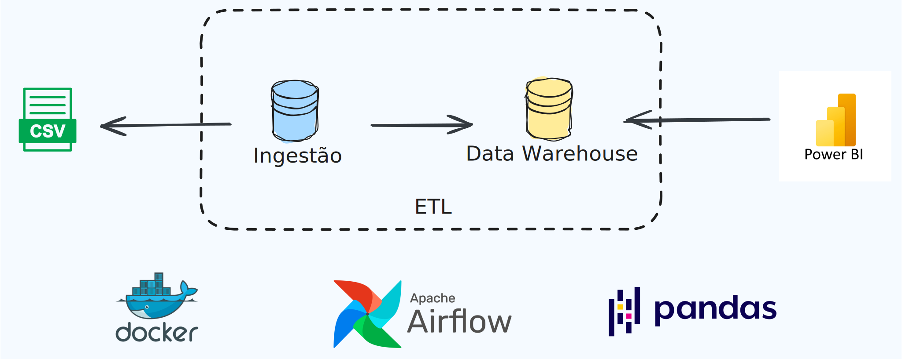

## TSE Data Analysis

**TSE Data Analysis** é um projeto de engenharia de dados que aplica conceitos de ETL e Orquestração construindo uma solução baseado em um dataset dos [Dados abertos do TSE](https://dadosabertos.tse.jus.br/dataset/resultados-2022) para Business Intelligence e Analytics.

  

### Data Stack
  + Pandas
  + Apache Airflow

Utilizando o Apache Airflow para a orquestração de tasks e DAGs, foi construída uma pipeline de ETL. A extração dos dados, realizada com Pandas, empregou estratégias de otimização de memória, considerando que o dataset possui aproximadamente 4 gigabytes.

### Tecnologias
  + Docker
  + Jupyter Notebook
  + Poetry